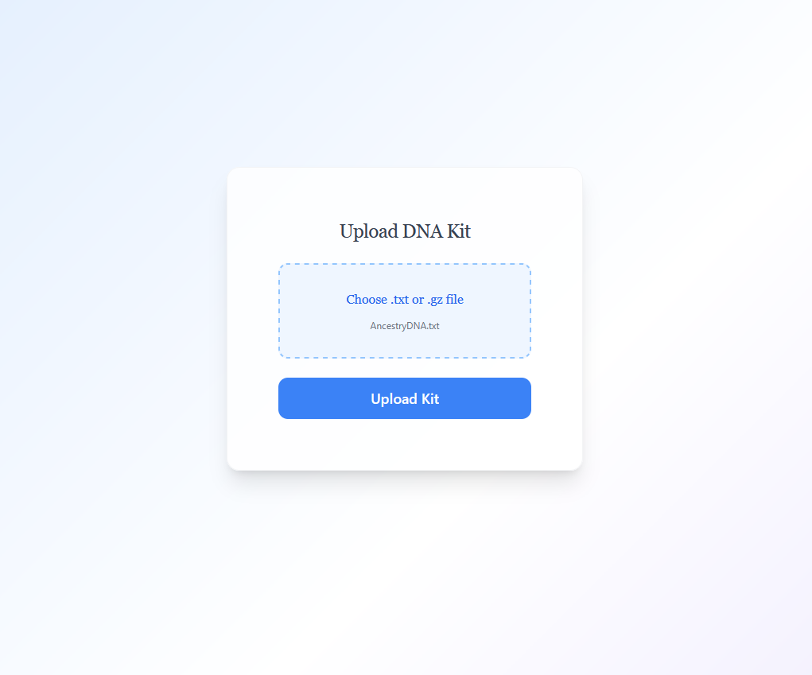
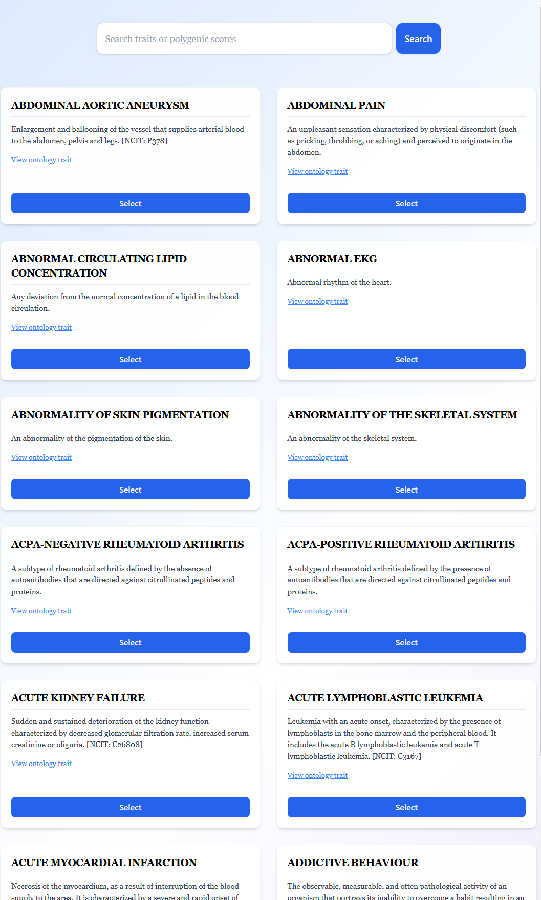
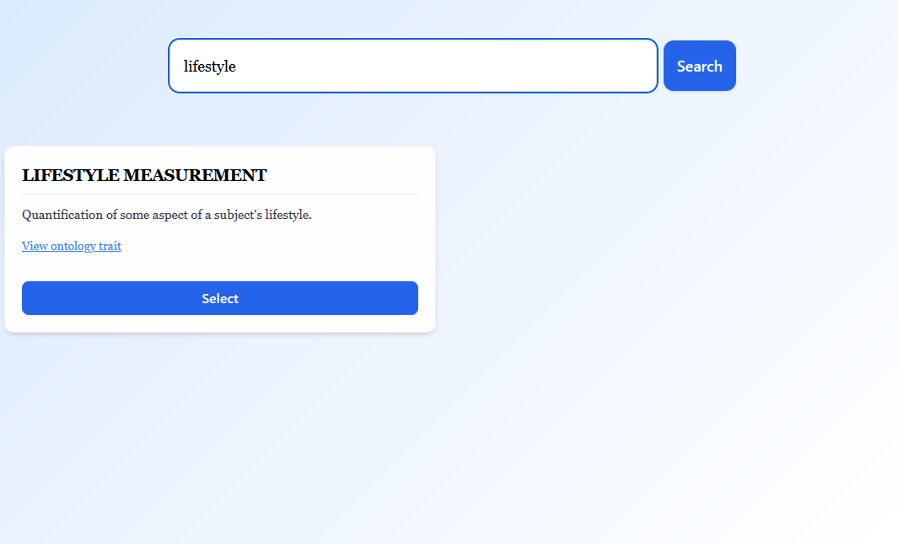
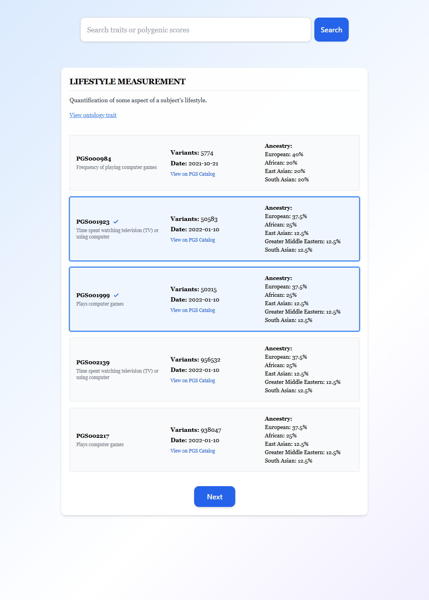
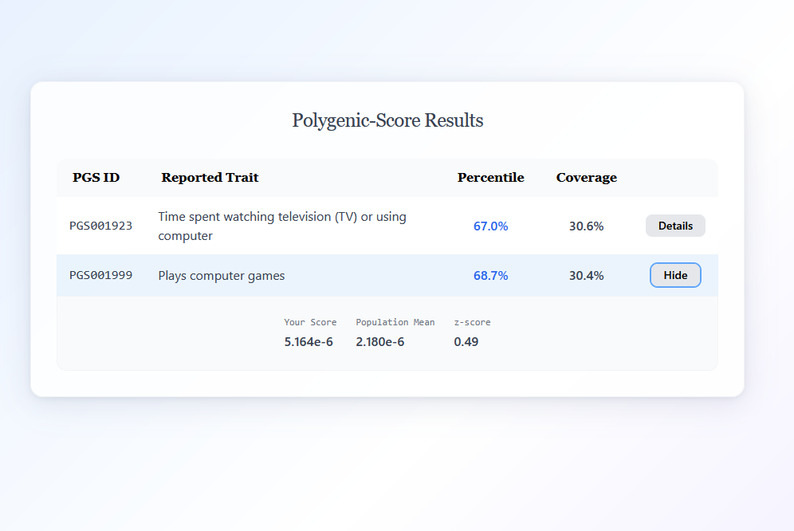

# easy-pgs

**easy-pgs** is a polygenic scoring tool that lets users upload their consumer DNA kits (for now just 23andMe, AncestryDNA) and score themselves on Polygenic Risk for various health traits from https://www.pgscatalog.org/. The intention is to provide a solution for consumer DNA kit analysis that minimizes exposure to 3rd party companies by allowing users to easily and quickly perform the analysis on their local machines. 


## Using easy-pgs

  
*Upload your raw DNA kit file (.txt or .gz)*

  
*Select traits from a curated list*

  
*Use keywords to find traits by name or function*

  
*View associated PGS IDs before scoring*

  
*Results page which includes percentile rank on traits versus the population as well as % of relevant SNPs covered.*


## 🛠️ Setup & Run

*Note: this will be soon packaged as a desktop application with an installer. If you wish to run it just from source here are the instructions:*

1. **Clone the repository**
   ```bash
   git clone https://github.com/adamwestgate/easy-pgs.git
   cd easy-pgs
   ```

2. **Download reference genome (1000 Genomes GRCh37 build)**  
   Get the [PLINK2-compatible 1000G pgen set](https://www.cog-genomics.org/plink2/resources#1kg_phase3) and unzip it into:

   ```
   backend/data/reference_genomes/
   ```

3. **Install dependencies**  
   - [PLINK 1.9](https://www.cog-genomics.org/plink/1.9/) — binary must be accessible as `plink1` in your system PATH  
   - [PLINK 2.0](https://www.cog-genomics.org/plink/2.0/) — accessible as `plink2`  

4. **Run reference setup**  
   From the root directory, run:

   ```bash
   go run .\setup\
   ```

5. **Start the backend server**
   ```bash
   go run backend/server
   ```

6. **Start the frontend**
   ```bash
   npm install
   npm start
   ```